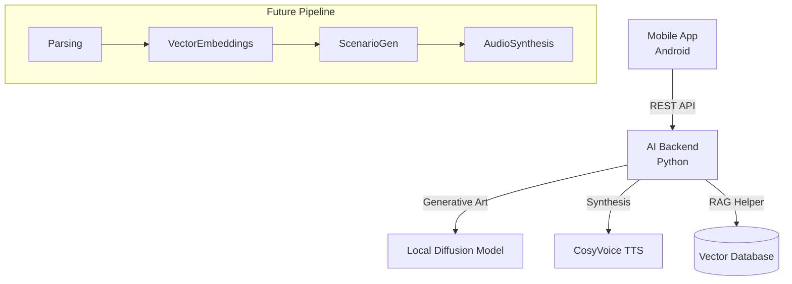

# BookWeaver: AI-Платформа для создания иммерсивных аудиоспектаклей

[](https://github.com/lapcevichme/bookweaver/releases)
[](LICENSE)
[](https://github.com/lapcevichme/bookweaver)

**BookWeaver** — это программный комплекс с открытым исходным кодом, который превращает обычные электронные книги (EPUB/TXT) в полноценные аудиоспектакли. Используя цепочку нейросетей (LLM + TTS + Voice Conversion), система не просто читает текст, а "разыгрывает" его: назначает роли, добавляет эмоции и накладывает атмосферные звуки.

---

## 📥 Где скачать приложение?

Для установки мобильного клиента на Android не обязательно собирать проект из исходного кода.

1. Перейдите на страницу **[Releases](https://github.com/lapcevichme/bookweaver/releases)** в этом репозитории.
2. Найдите последнюю версию (тег `Latest`).
3. Разверните спойлер **Assets**.
4. Скачайте файл **`app-release.apk`** и установите его на ваше устройство.

---

## ✨ Ключевые возможности

### 🎭 Режиссерский ИИ
* **Многоголосая озвучка:** Автоматическое определение говорящего и назначение уникального голоса каждому персонажу (используется Coqui XTTS).
* **Эмоциональный интеллект:** Система анализирует контекст сцены. Если персонаж шепчет в страхе или кричит от гнева, голос будет соответствовать эмоции (Voice Conversion).
* **Атмосфера (Ambient):** Автоматическое добавление фоновых шумов (дождь, таверна, лес) в зависимости от сюжета.

### 📱 Мобильный Плеер (Android)
* **Offline-First:** Плеер хранит базу данных локально.
* **Караоке-эффект:** Точная подсветка произносимых слов в реальном времени для погружения в текст.
* **Smart Stitching:** Умная склейка сотен аудио-фрагментов в единый поток без пауз (gapless playback).

### 🖥️ Desktop & Backend
* **Локальный сервер:** Весь пайплайн обработки (парсинг, генерация, синтез) работает локально.
* **JSON-Based Storage:** На текущем этапе проект использует файловую систему и JSON для хранения состояний, что упрощает ручное редактирование.

---

## ⚠️ Текущие ограничения (Beta)

* **Синхронизация:** Мобильное приложение стабильно работает в двух режимах: **полностью локально** (все файлы на телефоне) или **полностью онлайн** (стриминг с сервера). Гибридный режим (частичная догрузка) находится в экспериментальной стадии и может работать нестабильно.
* **Хранение данных:** Сейчас вся информация о персонажах и прогрессе хранится в JSON-файлах.

---

## 🗺 Roadmap и Планы на будущее

Проект активно развивается. Вот основные направления работы:

### 🧠 Интеллектуальный RAG-помощник (Book Companion)
Планируется внедрение чат-бота, который "читает" книгу вместе с вами.
* **Context-Aware Answers:** Вы можете спросить: *"Кто этот персонаж и где мы его встречали?"*, и бот ответит, используя базу знаний книги.
* **Spoiler Protection:** Благодаря RAG (Retrieval-Augmented Generation), бот будет знать вашу текущую позицию в книге и **никогда не выдаст спойлер** из будущих глав.

### 🎨 Визуализация (Generative AI)
* **Иллюстрации сцен:** Генерация изображений текущей сцены на лету с помощью диффузионных моделей (Stable Diffusion/Flux), используя контекст главы.
* **Портреты персонажей:** Автоматическая генерация аватарок героев на основе их текстового описания в книге.

### ⚙️ Технологический переход
* **База данных:** Миграция с JSON на полноценную БД (PostgreSQL/SQLite) с векторным поиском для RAG.
* **Локальные LLM:** Полный отказ от облачных API (Gemini) в пользу локальных моделей (через `llama.cpp` / GGUF) для полной приватности и автономности.
* **Новый TTS:** Переход с Coqui XTTS на **CosyVoice** для достижения SOTA-качества речи и лучшего клонирования эмоций.

---

## 🏗 Архитектура

1.  **AI Backend (Python / FastAPI):** "Мозг" системы. Выполняет тяжелые задачи: анализ текста, генерацию сценариев, синтез речи.
2.  **Mobile App (Kotlin / Compose):** Точка входа пользователя. Управление генерацией и воспроизведение.
3.  **Desktop Host (Kotlin Multiplatform):** Сервер обнаружения и хост ресурсов.


---

## 🛠 Установка и запуск (Для разработчиков)

Если вы хотите развернуть свой сервер генерации или внести вклад в проект.

### Предварительные требования
* Python 3.10+
* CUDA-совместимая видеокарта (для TTS и VC)
* Android Studio (для сборки клиента)

### 1. Запуск Бэкенда (AI Server)
```bash
cd backend
python -m venv venv
source venv/bin/activate  # или venv\Scripts\activate на Windows
pip install -r requirements.txt
# Создайте .env файл с ключом GEMINI_API_KEY
python api_server.py
```

### 2. Сборка Android клиента
Откройте папку `mobile` в Android Studio и запустите конфигурацию `app`. Либо используйте готовый APK из релизов.

---

## 📄 Лицензия
[MIT](LICENSE)